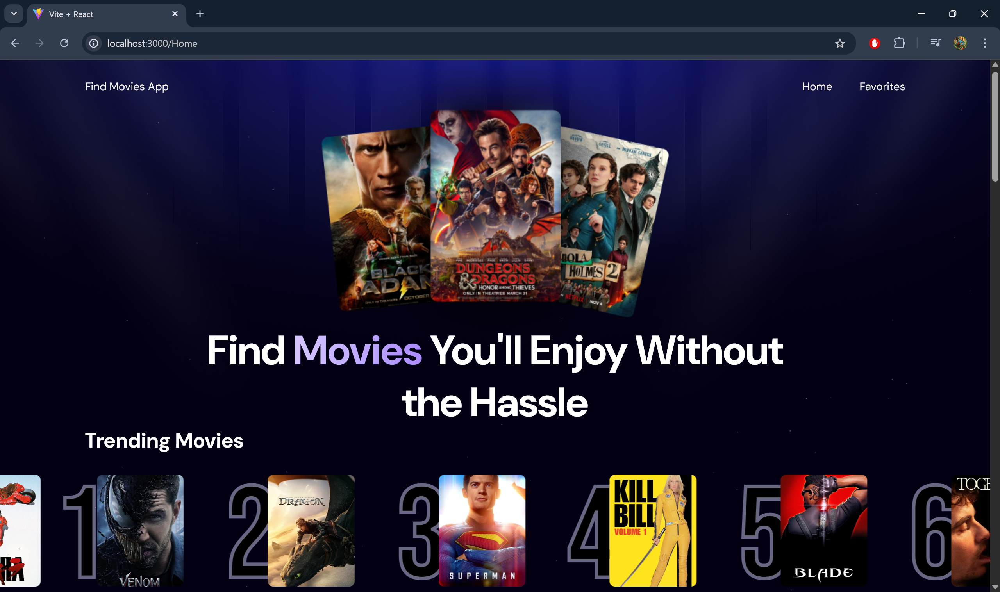
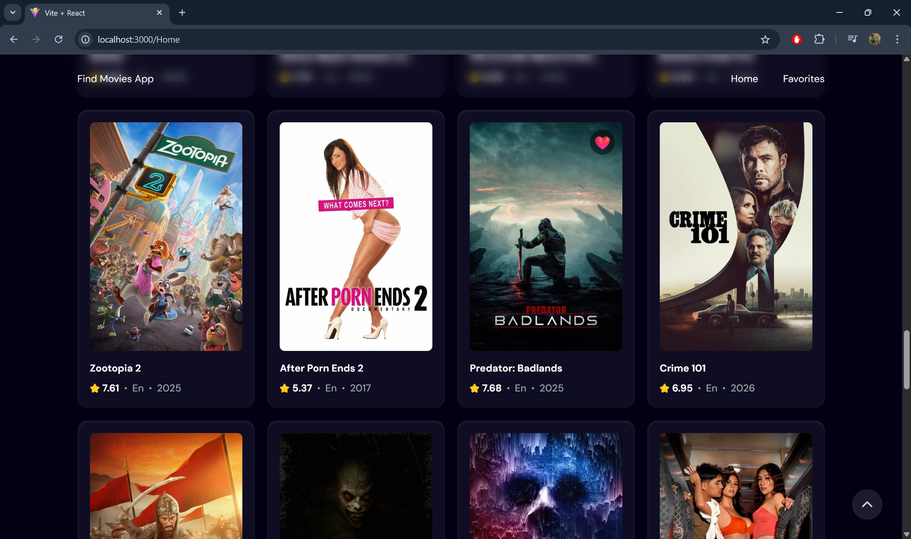
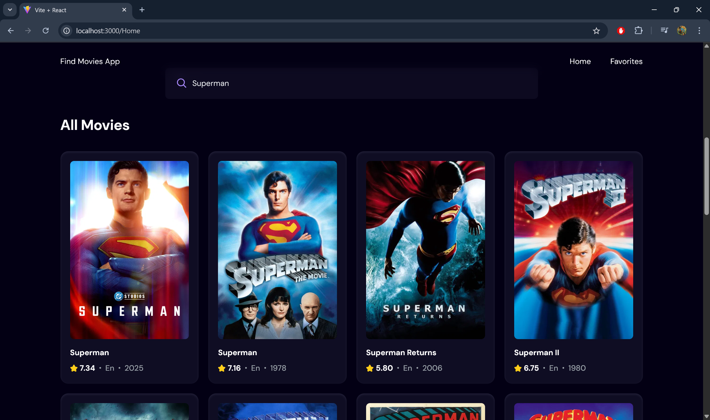
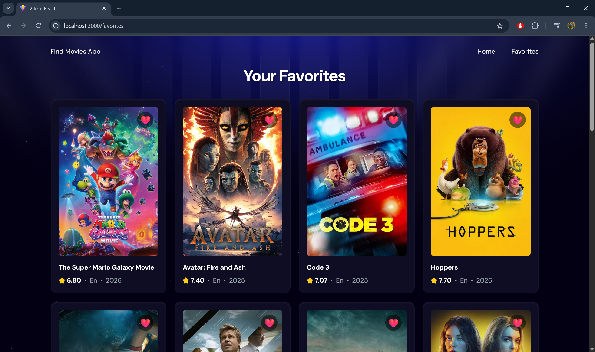
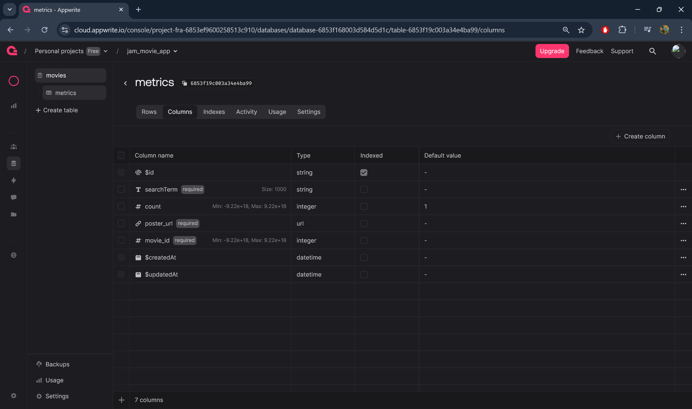
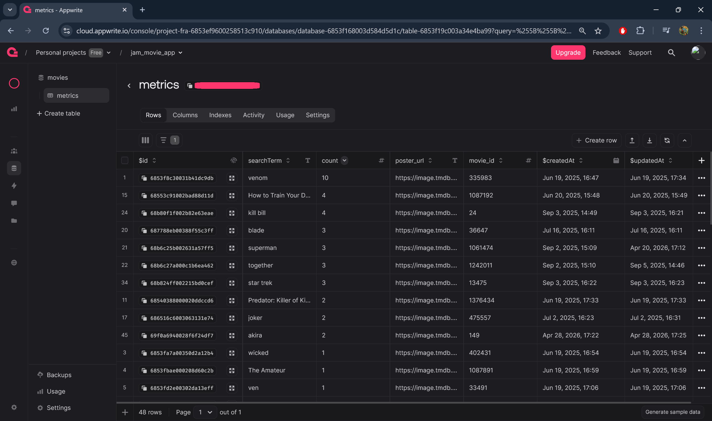

# Find Movies App

> Проект представляет собой React SPA для поиска и отслеживания фильмов на основе TMDB API и облачной базы данных Appwrite.


---

## Скриншоты интерфейса

**Главная страница**


**Карточки фильмов**


**Результаты поиска**


**Избранное**


**Созданные атрибуты для хранения в Appwrite (BaaS)**


**Собранная статистика поисковых запросов в Appwrite**


---

## О проекте

**Find Movies App** — одностраничное приложение (SPA) на React 19 и TypeScript 7 для просмотра, поиска и сохранения любимых фильмов. Интегрируется с **TMDB API** (каталог фильмов) и **Appwrite** (Backend as a Service) для хранения статистики поисковых запросов и избранного.

Проект создан для демонстрации реальных паттернов фронтенд-разработки: интеграция с REST API, глобальное управление состоянием, постоянное хранилище данных, бесконечная пагинация, оптимизация производительности.

---

## Реализованный функционал

- **Поиск фильмов** — поисковый запрос в реальном времени передаётся в TMDB API с debounce 1 секунда
- **Фильтрация и сортировка** — три стратегии через `SortControls`: Popular (по умолчанию), Top Rated (≥10 000 голосов), Newest (уже вышедшие, ≥100 голосов)
- **Бесконечная пагинация** — подгрузка следующих страниц через `IntersectionObserver` при скролле до последнего элемента
- **Дедупликация результатов** — при пагинации фильмы схлопываются по `movie.id` через `Map`, исключая дубли
- **Избранное (Favorites)** — добавление/удаление фильмов, состояние хранится в `localStorage` через React Context и не сбрасывается при перезагрузке
- **Улучшенный UX карточек** — активная кнопка ❤️ видна всегда, неактивная 🤍 появляется при наведении (Tailwind `group/group-hover`)
- **Трендовые фильмы** — два режима через `TrendingControls`:
  - **All Time** — агрегированный счётчик поисковых запросов в Appwrite (коллекция `metrics`)
  - **Last 24h** — группировка по `movie_id` из лога `search_logs` за последние 24 часа
- **Бегущая строка (Ticker)** — лента трендов автоматически прокручивается с CSS `@keyframes`, дублированными элементами и остановкой при наведении
- **Состояния загрузки и ошибок** — спиннер во время запроса, осмысленные сообщения об ошибках
- **Защита от null** — фолбэк на `/No-Poster.png` при отсутствии постера
- **Безопасность** — все API-ключи в переменных окружения (`.env`), не попадают в код

---

## Технологический стек

| Категория | Технология |
|-----------|-----------|
| **Framework** | React 19.1 |
| **Язык** | TypeScript 7 |
| **Сборка** | Vite 6.3 |
| **Роутинг** | React Router DOM 7 |
| **Стейт-менеджмент** | React Context API |
| **Стили** | Tailwind CSS 4 (через `@tailwindcss/vite`) |
| **REST API** | TMDB API (discover/search/movie) |
| **BaaS** | Appwrite SDK 18 |
| **Утилиты** | react-use (debounce), react-doctor |
| **Линтер** | ESLint 9 (flat config) |
| **Хранилище браузера** | localStorage |

---

## Установка и запуск

### Требования

- [Node.js](https://nodejs.org/) v18+
- [TMDB API ключ](https://developer.themoviedb.org/reference/getting-started) (бесплатная регистрация)
- Проект в [Appwrite](https://appwrite.io/) с настроенной базой данных и **двумя коллекциями**

### 1. Клонировать репозиторий

```bash
git clone https://github.com/r1v1an/React_19_JS_Find_Movie_DB_API.git
cd React_19_JS_Find_Movie_DB_API
```

### 2. Установить зависимости

```bash
npm install

```

### 3. Настроить переменные окружения

Создай файл `.env.local` в корне проекта:

```env
VITE_TMDB_API_KEY=YOUR_tmdb_bearer_token
VITE_APPWRITE_PROJECT_ID=YOUR_appwrite_project_id
VITE_APPWRITE_DATABASE_ID=YOUR_appwrite_database_id
VITE_APPWRITE_COLLECTION_ID=YOUR_appwrite_collection_id
VITE_APPWRITE_COLLECTION_LOGS_ID=YOUR_appwrite_collection_logs_id
```

> ⚠️ Никогда не коммить `.env.local` в репозиторий. Он уже добавлен в `.gitignore`.

Шаблон доступен в файле `.env.example`.

### 4. Запустить дев-сервер

```bash
npm run dev
```

Приложение будет доступно по адресу **http://localhost:3000**

---

## Схема коллекций Appwrite

Для работы приложения необходимо создать **две коллекции** в одной базе данных Appwrite.

### Коллекция #1 — `metrics` (VITE_APPWRITE_COLLECTION_ID)

Для агрегации трендов «All Time». Каждый поисковый запрос увеличивает счётчик.

| Атрибут | Тип | Required | Примечания |
|---------|-----|----------|-----------|
| `searchTerm` | String | ✅ | Size: 1000 |
| `count` | Integer | ❌ | Min: -9.22e+18, Max: 9.22e+18 |
| `movie_id` | Integer | ✅ | Min: -9.22e+18, Max: 9.22e+18 |
| `poster_url` | String | ✅ | — |

**Permissions**: `read`/`write` для уровня `any` (для портфолио-демонстрации).

### Коллекция #2 — `search_logs` (VITE_APPWRITE_COLLECTION_LOGS_ID)

Для лога каждого поискового запроса (режим «Last 24h»). Документы не обновляются, только создаются.

| Атрибут | Тип | Required | Примечания |
|---------|-----|----------|-----------|
| `searchTerm` | String | ✅ | Size: 1000 |
| `movie_id` | Integer | ✅ | Min: -9.22e+18, Max: 9.22e+18 |
| `poster_url` | String | ✅ | — |

**Permissions**: `read`/`write` для уровня `any`.

**Инструкция по созданию**:
1. Войди в [Appwrite Console](https://console.appwrite.io)
2. Создай проект → создай базу данных
3. Внутри базы создай две коллекции с именами `metrics` и `search_logs`
4. Для каждой коллекции добавь атрибуты по таблице выше
5. Перейди в **Settings** каждой коллекции → скопируй **Collection ID**
6. Вставь IDs в `.env.local`

---

## Структура проекта

```
src/
├── App.tsx                      # Корневой компонент + роутинг
├── main.tsx                     # Точка входа
├── types.ts                     # Единый источник типов
├── vite-env.d.ts                # Типы Vite env
│
├── components/                  # UI-компоненты (11 шт.)
│   ├── BackToTop.tsx            # Кнопка "наверх"
│   ├── CloseButton.tsx          # Кнопка закрытия модалки
│   ├── FavoriteButton.tsx       # Добавление в избранное
│   ├── MovieCard.tsx            # Карточка фильма
│   ├── MovieDetailsModal.tsx    # Модалка с деталями
│   ├── NavBar.tsx               # Навигация
│   ├── Search.tsx               # Поле поиска
│   ├── SortControls.tsx         # Сортировка (Popular / Top Rated / Newest)
│   ├── Spinner.tsx              # Индикатор загрузки
│   ├── Trending.tsx             # Блок трендов с ticker-лентой
│   └── TrendingControls.tsx     # Переключатель периода трендов
│
├── contexts/
│   └── MovieContext.tsx         # React Context для избранного
│
├── pages/
│   ├── Home.tsx                 # Главная (поиск, пагинация, тренды)
│   ├── Favorites.tsx            # Страница избранного
│   └── Trending.tsx             # Отдельная страница трендов
│
└── services/
    ├── tmdb-api.ts              # TMDB API (fetchMovies, fetchMovieDetails)
    └── appwrite-api.ts          # Appwrite API (updateSearchCount, logSearchTerm, getDailyTrendingMovies)
```

---

## Ключевые технические решения

- **TypeScript-first архитектура** — строгая типизация API-контрактов в `src/types.ts`: `Movie`, `MovieDetails`, `TrendingMovie`, `SortOption`, `TrendingPeriod`, `MovieContextValue`. Все сервисы и UI импортируют типы из одного источника, что исключает расхождение контрактов
- **Двойная стратегия трендов** — два разных паттерна для двух UX-сценариев:
  - `updateSearchCount` — агрегирующий счётчик (upsert) через Appwrite для «All Time», один документ на уникальный `searchTerm`
  - `logSearchTerm` / `getDailyTrendingMovies` — append-only лог с серверной сортировкой `$createdAt` и клиентской группировкой по `movie_id` для «Last 24h»
- **Server-side фильтрация** — параметры `vote_count.gte` и `primary_release_date.lte` отдаются TMDB API, а не вычисляются на клиенте: для Top Rated — порог 10 000 голосов, для Newest — только вышедшие релизы с ≥100 голосами
- **IntersectionObserver + useRef** — бесконечная пагинация без сторонних библиотек; флаг `isLoading` предотвращает множественные запросы
- **Дедупликация через Map** — при дозагрузке страниц фильмы схлопываются по `movie.id` через `Map`, исключая дубликаты на стыке страниц
- **useDebounce из react-use** — отложенный поисковый запрос на 1 секунду вместо ручного `setTimeout` (проверенное решение + встроенная очистка таймера)
- **StrictMode-safe useRef** — защита от двойного срабатывания `useEffect` в режиме разработки, которая могла бы затирать `localStorage`
- **Разделение ответственности (SoC)** — логика API вынесена в `src/services/`, компоненты остаются чистыми; два сервиса (TMDB и Appwrite) не зависят друг от друга, оба импортируют только `types.ts`
- **CSS `@keyframes` вместо JS-скролла** — анимация бегущей строки трендов выполняется на compositor-потоке (60 fps), дублирование элементов обеспечивает бесшовную петлю, остановка при наведении — через `animation-play-state: paused`
- **Tailwind group/group-hover** — управление видимостью кнопки лайка без единой строки кастомного CSS: неактивная иконка появляется только при наведении на карточку
- **BFF-паттерн с защитой ключей** — все секреты импортируются через `import.meta.env.VITE_*`, конфигурация `Client` в Appwrite выполняется однократно

---

## Контакты

Если есть вопросы или хотите сотрудничать — пишите!

AinurSirazhev@gmail.com